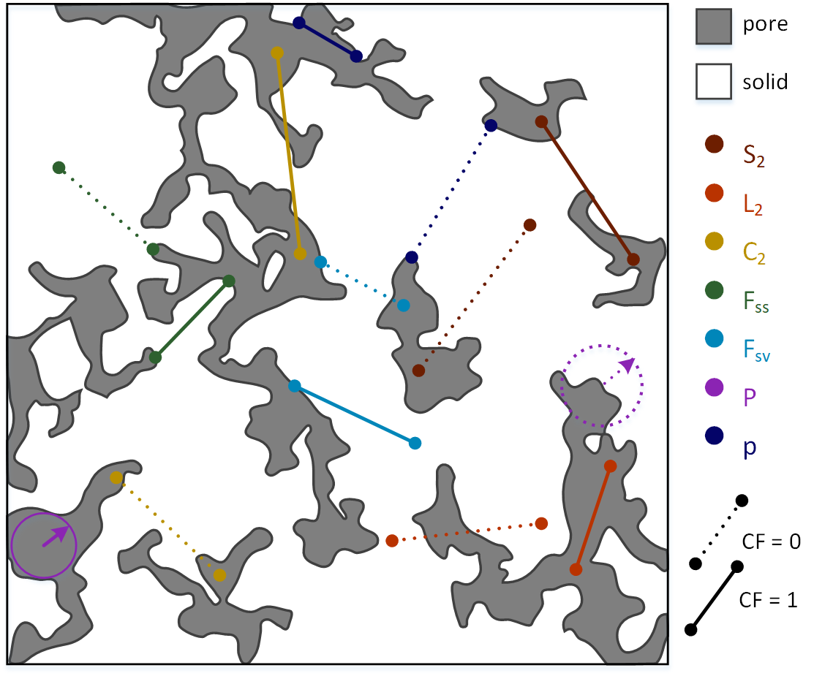

# CorrelationFunctions.jl

## General information
`CorrelationFunctions.jl` is a library to compute all classical correlation
functions from 2D and 3D images.

Currently, we provide functions to compute:
1. $S_2$ (two-point probability)
2. $L_2$ (lineal path function)
3. $C_2$ (cluster function)
4. $F_{ss}$ (surface-surface function)
5. $F_{sv}$ (surface-void function)
6. $P$ (pore-size function)
7. $p$ (chord length function)
8. $\rho$ (phase cross-correlation function)
9. $F_{sss}$ (surface-surface-surface function)
10. $F_{svv}$, $F_{ssv}$, … (other three-point surface-void functions)

Some additional three-point or non-classical CFs currently under
development. The general scheme of computations for all major functions is shown
in figure below:

Salvatore Torquato's book
["Random Heterogeneous Materials"](https://link.springer.com/book/10.1007/978-1-4757-6355-3)
provides a comprehensive theoretical summary on all classical CFs.

## Installation
The package is available through Julia's Pkg ecosystem.
For example, from Julia REPL: `import Pkg; Pkg.add("CorrelationFunctions")`

## Documentation
All functions are described in the documentation, you can also get help on each
function in the REPL (using `?`). The documentation for the most recent release
is available here on
[GitHub Pages](https://fatimp.github.io/CorrelationFunctions.jl/stable/index.html).

Alternatively, to build a documentation locally do the following:
1. From Julia REPL: `import Pkg; Pkg.add("Documenter")`
2. From shell, this directory being the working directory: `cd docs && julia make.jl`

## Tutorials
Numerous Jupiter notebooks with examples of how to apply the package to compute
various correlation functions are available in our FaT iMP research group's
repository, e.g.:
1. [Example1](https://github.com/fatimp/correlation-function-paper/tree/master/notebook)
2. [Example2](https://github.com/fatimp/surfsurf-paper-2/tree/master/notebooks)
3. [Example3](https://github.com/fatimp/surfsurf-paper/tree/master/scripts%26data)

Video tutorial is currently in production...

## Describing scientific papers
The functionality of the package is described in following scientific papers,
please, support us by citations if you find our code useful:

1. The main paper describing the package and its CPU and GPU implementations for
all classical CFs [Postnicov, V., Samarin, A., Karsanina, M. V., Gravey M.,
Khlyupin, A. & Gerke, K. M. (2023). Evaluation of classical correlation
functions from 2/3D images on CPU and GPU architectures: introducing
CorrelationFunctions.jl (submitted to Computer Physics Communications)]
2. The digital approach to compute 2-point surface functions; also this paper
introduces the C0.5 criterion (the package contains the function to evaluate it
for input images) to judge the quality of the image to access such CFs
[Samarin, A., Postnicov, V., Karsanina, M. V., Lavrukhin, E. V., Gafurova, D.,
Evstigneev, N. M., Khlyupin, A. & Gerke, K. M. (2023). Robust
surface-correlation-function evaluation from experimental discrete digital
images. Physical Review E, 107(6),
065306.](https://journals.aps.org/pre/abstract/10.1103/PhysRevE.107.065306)
3. The truly exact approach to compute 2- and 3-point correlation functions on
smooth boundary sets, improved edge filter, computation of 3-point surface
functions for digital images
[Postnicov, V., Karsanina, M. V., Khlyupin, A., & Gerke, K. M. (2023). The 2-and
3-point surface correlation functions calculations: From novel exact continuous
approach to improving methodology for discrete images. Physica A: Statistical
Mechanics and its Applications, 628,
129137.](https://www.sciencedirect.com/science/article/abs/pii/S0378437123006921)
