# Directional Functions

This is a documentation for `CorrelationFunctions.Directional` module. The
documentation is divided into the following topics:

* **[Boundary Conditions](@ref)** page describes boundary conditions when
  calculations cross the boundary of a system.
* **[Directions](@ref)** page describes directions along which the correlation
  functions are computed.
* **[Correlation Functions](@ref)** page contains the exhaustive list of
  correlation functions supported by this package.
* **[Results](@ref)** page contains comparison of correlation functions from
  this package with some known theoretical results.

## Boundary Conditions

Suppose you are calculating correlation functions for a sequence of length
$N$. Calculation of a vast majority of the functions in this package can be
reduced to a calculation of autocorrelation between two sequences, $a$ and $b$:

$h_k = \frac{\sum\limits_{l=0}^{\tilde{N}} a_l b_{k+l}}{\tilde{N}}$

where $\tilde{N}$ is a normalization factor. There are few boundary conditions
which define which value $\tilde{N}$ can take. Here they are:

* Periodic boundary conditions. In this case $\tilde{N} = N$. Indexing to $a$
  and $b$ is performed modulo $N$.
* Non-periodic boundary conditions. In this case $\tilde{N}_k = N - k$.
* Calculations using a mask. In this case $l$ runs not from $0$ to $\tilde{N}$,
  but can take only values allowed by a boolean mask, which must be of the same
  length as the input sequence (or, more generally, of the same shape as the
  input array).

Boundary conditions are selected by a keyword argument `mode`. The mode is a
value of the type `AbstractMode`. Constructors for descendants of that type are
following:

```@docs
Utilities.Periodic
Utilities.NonPeriodic
Utilities.Mask
Utilities.AbstractMode
```

## Directions

Functions based on two-point statistics from `Directional` module will require a
direction along which the function is calculated (usually as their third
argument). You can specify these directions:

```@docs
Utilities.DirX
Utilities.DirY
Utilities.DirZ
Utilities.DirXY
Utilities.DirYX
Utilities.DirXZ
Utilities.DirZX
Utilities.DirYZ
Utilities.DirZY
Utilities.DirXYZ
Utilities.DirXZY
Utilities.DirYXZ
Utilities.DirZYX
Utilities.AbstractDirection
```

The module `Map` can use these directions to extract directional information from
correlation maps.

These rules can help you to memoize the correspondence between symbolic
designations and vectors:

* `DirFoo` types can contain from one to three characters `X`, `Y` and `Z`. Each
  character can occur only once (there is a type `DirXYZ`, but no type
  `DirXXY`).
* When a character does not occur is a designation (e.g, there is no `Z` in
  `DirXY`) that coordinate remains constant in a slice (in the example above
  $z = \text{const}$).
* The names of the axes have a "natural order" which is `X`, `Y`, `Z`. In a
  designation, the first axis which breaks that order get the minus sign in the
  direction vector (e.g. `DirXZY` equals to `(1, -1, 1)` because `Y` is in the
  third position, not in the second, `DirZX` equals to `(-1, 0, 1)` because `X`
  is in the second position, not in the first, etc.)

Functions based on three-point statistics require a set of points in which they
are calculated (usually as the third and the fourth arguments). This set can be
generated by `Utilities.right_triangles` function.

## Correlation Functions

### Two-point statistics

```@docs
Directional.s2
Directional.c2
Directional.cross_correlation
Directional.surf2
Directional.surfvoid
```

### Three-point statistics
```@docs
Directional.s3
Directional.c3
Directional.surf3
Directional.surf2void
Directional.surfvoid2
```

### Other correlation functions
```@docs
Directional.pore_size
Directional.chord_length
Directional.l2
```

The `pore_size` function is also reexported from `CorrelationFunctions`
directly, not being actually a "directional" function.

## Results

`CorrelationFunctions.jl` is tested on overlapping disks and balls of constant
radius $R$ with centers generated by Poisson process with parameter $\lambda$
(see section 5.1 of Random Heterogeneous Materials). An example of a
two-dimensional two-phase system generated in this way is on the picture ($R =
25$ and $\lambda = 5 \cdot 10^{-4}$):


Plots of all correlation functions calculated by `CorrelationFunctions.jl` for
overlapping disks along with their theoretical values are given below. There
are also plots of relative errors calculated as

$\text{err}(x) = \mid \frac{\text{calculation}(x) -
\text{theory}(x)}{\text{theory}(x)} \mid$

### Two-dimensional systems

#### Methodology

All functions in this section with exception of pore size and chord length
functions are calculated on 15 random datasets generated with parameters $R =
25$ and $\lambda = 5 \cdot 10^{-4}$. Each dataset is an image with dimensions
`4000x4000` pixels. The final result is an average of results on those 15
datasets. When function fastly decreases to zero a plot of a natural logarithm
of that function is provided.

Pore size and chord length functions are calculated on one `4000x4000`
dataset with the same parameters as above. A theoretical value is computed by
averaging a theoretical function across each bin of a histogram returned by
`pore_size` or `chord_length` function. Because both pore size and cord length
functions decrease to zero with increase of their arguments, the relative errors
are calculated for the corresponding cummulative distribution functions.

All functions are called with default optional arguments unless explicitly
stated otherwise.

#### Two point $S_2(x)$ function

| S2  | Error |
|-----|-------|
| 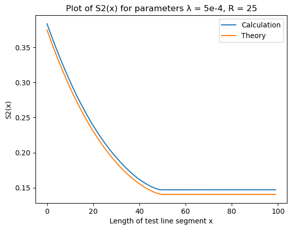 | 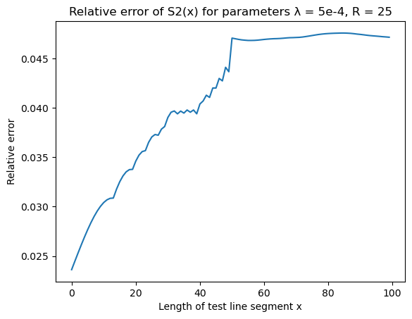 |

#### Lineal path $L_2(x)$ function

| L2  | Error |
|-----|-------|
| 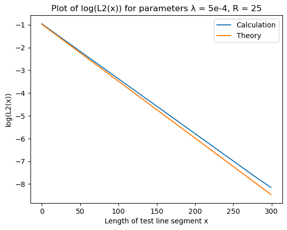 | 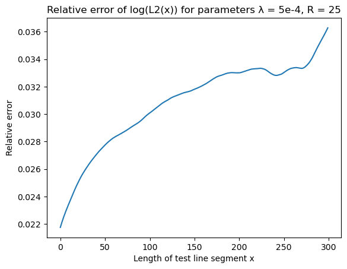 |

#### Surface-surface $F_{ss}(x)$ function

| Surface-surface   | Error |
|-------------------|-------|
| 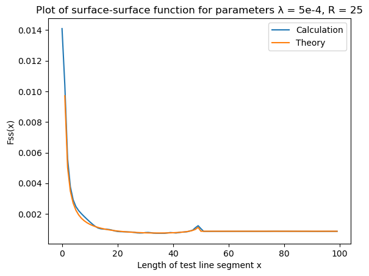 | 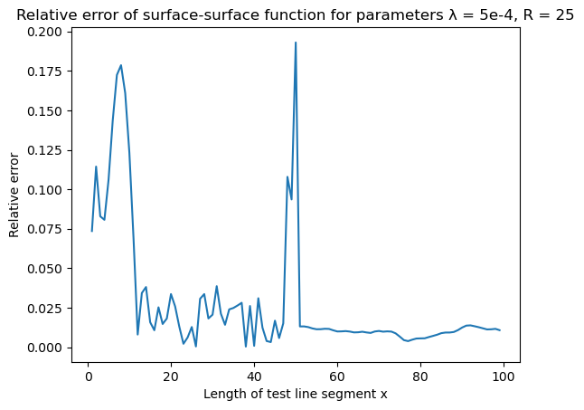 |

#### Surface-void $F_{sv}(x)$ function

| Surface-void     | Error |
|-------------------|-------|
| 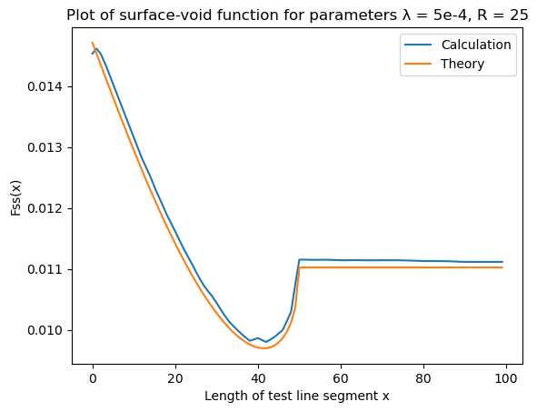 |  |

#### Pore size $P(x)$ function

| Pore size   | Error |
|-------------|-------|
| 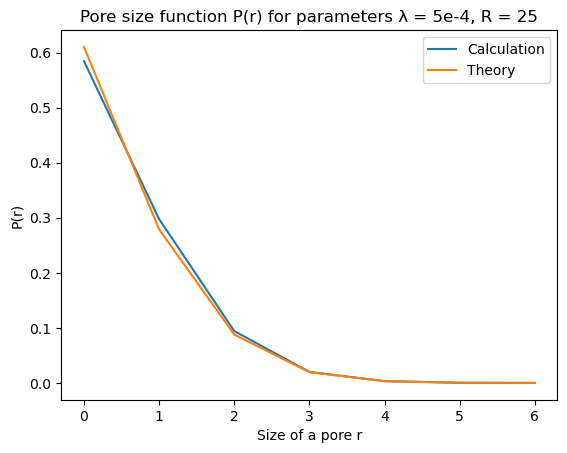 |  |

#### Chord length $p(x)$ function

Chord length function `chord_length` was called with parameter `nbins = 30`.

| Chord length   | Error |
|----------------|-------|
| 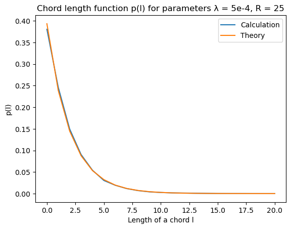 | 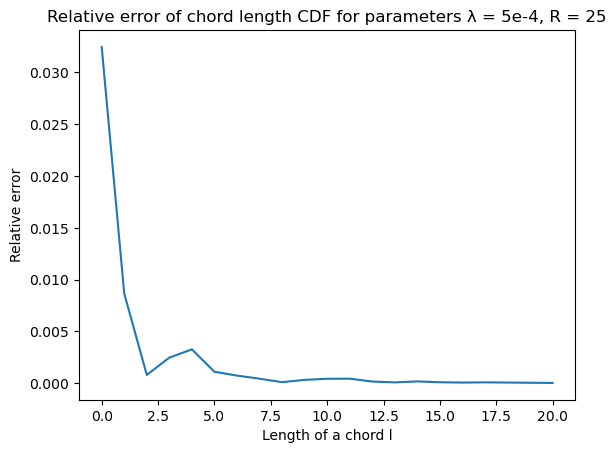 |

### Three-dimensional systems

#### Methodology

The idea is the same as in two-dimensional case, but chosen parameters are
slightly different. The functions are averaged over 5 `500x500x500` datasets
with ball radius $R = 20$ and Poisson process parameter $\lambda = 3 \cdot
10^{-5}$.

#### Two point $S_2(x)$ function

| S2  | Error |
|-----|-------|
|  |  |

#### Lineal path $L_2(x)$ function

| L2  | Error |
|-----|-------|
| 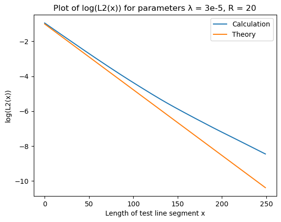 |  |

#### Surface-surface $F_{ss}(x)$ function

| Surface-surface   | Error |
|-------------------|-------|
|  |  |

#### Surface-void $F_{sv}(x)$ function

| Surface-void     | Error |
|-------------------|-------|
| 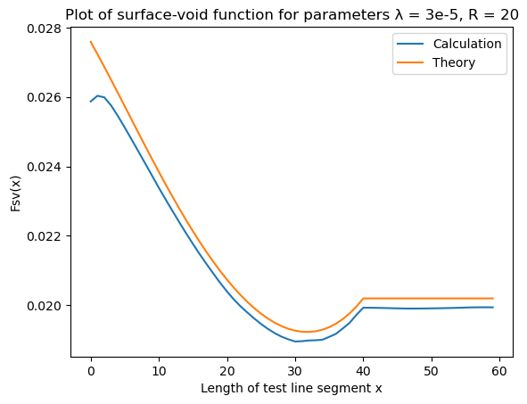 |  |

#### Pore size $P(x)$ function

| Pore size   | Error |
|-------------|-------|
|  |  |

#### Chord length $p(x)$ function

Chord length function `chord_length` was called with parameter `nbins = 30`.

| Chord length   | Error |
|----------------|-------|
|  |  |
