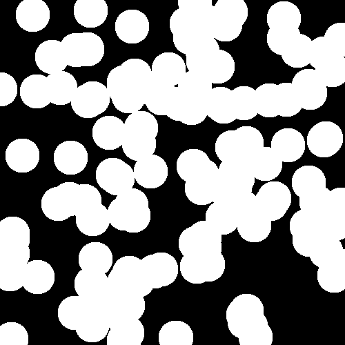
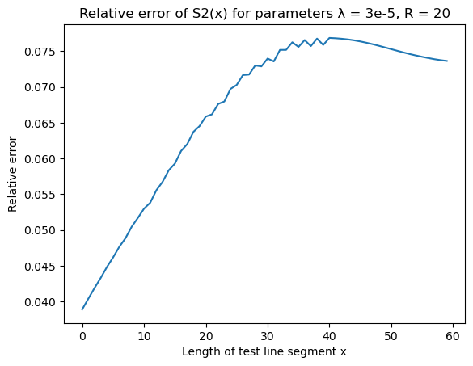

# Directional Functions

This is a documentation for `CorrelationFunctions.Directional` module. The
documentation is divided into the following topics:

* **[Correlation Functions](@ref)** page contains the exhaustive list of
  correlation functions supported by this package.
* **[Accessing Data](@ref)** page describes how to access data returned by
  correlation functions.
* **[Boundary Conditions](@ref)** page describes boundary conditions when
  calculations cross the boundary of a system.
* **[Directions](@ref)** page describes directions along which the correlation
  functions are computed.
* **[Indicator Functions](@ref)** page describes how to construct customary
  indicator functions.
* **[Results](@ref)** page contains comparison of correlation functions from
  this package with some known theoretical results.

## Correlation Functions

The following correlation functions are supported:

* Lineal-path $L_2$ function.
* Two point $S_2$ function.
* Cluster $C_2$ function.
* Surface-surface $F_{ss}$ function.
* Surface-void $F_{sv}$ function.
* Pore size $P$ function.
* Chord length $p$ function.

```@docs
Directional.l2
Directional.s2
Directional.c2
Directional.surfsurf
Directional.surfvoid
Directional.pore_size
Directional.chord_length
```

The `pore_size` function is also reexported from `CorrelationFunctions`
directly, not being actually a "directional" function.

## Accessing Data

The most functions in this package (with exception to `pore_size` and
`chord_length`) return a value of type `CorrelationData`:

```@example
using CorrelationFunctions.Directional
using Random

a = l2(rand(MersenneTwister(1453), 0:1, (100, 100, 100)), 1)
```

You can extract the values along any computed direction using indexing operator:
```@example
using CorrelationFunctions.Directional
using Random

a = l2(rand(MersenneTwister(1453), 0:1, (100, 100, 100)), 1)
a[:y]
```

Also you can average results along multiple directions using `StatsBase.mean`
function:
```@example
using CorrelationFunctions.Directional
using Random
using StatsBase

a = l2(rand(MersenneTwister(1453), 0:1, (100, 100, 100)), 1)
mean(a, [:x, :y])
```

Calling `StatsBase.mean` without the second argument averages along all computed
directions.

Another useful function is `Directional.direction`:
```@docs
Directional.directions
```

## Boundary Conditions

When calculating the value of correlation functions like $S_2$ or $L_2$ it may
be necessary to cross a boundary of the input array. There two options how
`CorrelationFunctions.jl` handles this situation:

* Impose "closed walls" (CW) boundary conditions on the input data. This means
  that the boundary is not crossed and correlation functions gather less
  statistics for bigger length of test line segments.
* Impose periodic boundary conditions (PBC) on the input data. This means that
  the input is wrapped around itself (i.e. modular arithmetic is used to access
  the array).

PBC is used when you specify `periodic = true` when call a correlation function,
otherwise CW is used.

```@docs
Directional.S2FTPlans
```

## Directions

Correlation functions can be computed in many directions depending on how test
line segments are aligned with the input array. The default directions are
`[:x]` for 1D, `[:x, :y]` for 2D and `[:x, :y, :z]` for 3D arrays. Possible
directions and their meaning are described in the documentation for
`directionNDp` functions where `N` stands for `1`, `2` and `3`.

```@docs
Directional.direction1Dp
Directional.direction2Dp
Directional.direction3Dp
Directional.default_directions
Directional.unit_length
```

These rules can help you to memoize the correspondence between symbolic
designations and vectors:

* Symbolic designations can contain characters `x`, `y` and `z` and be from one
  to three symbols long. Each character can occur only once (so `xyz` is a valid
  designation and `xxy` is not).
* When a character does not occur is a designation (e.g, `xy`) that coordinate
  remains constant in a slice (in the example above $z = \text{const}$).
* The names of the axes have a "natural order" which is `x`, `y`, `z`. In a
  designation the first axis which breaks that order get the minus sign in the
  direction vector (e.g. `xzy` equals to `(1, -1, 1)` because `y` is in the
  third position, not in the second, `zx` equals to `(-1, 0, 1)` because `x` is
  in the second position, no in the first, etc.)

## Indicator Functions

Internally, the functions `c2`, `surfsurf` and `surfvoid` (see
[Correlation Functions](@ref)) are reduced to `s2` passing more generic
indicator functions rather than simply a phase. This feature is also exposed to
users. If you want to use a custom indicator function, you need to wrap it to
either `SeparableIndicator` or `InseparableIndicator` structure, calling the
corresponding constructor. Note that `s2` performs much better on big arrays
when using `SeparableIndicator`.

```@docs
Directional.AbstractIndicator
Directional.SeparableIndicator
Directional.InseparableIndicator
```

## Results

`CorrelationFunctions.jl` is tested on overlapping disks and balls of constant
radius $R$ with centers generated by Poisson process with parameter $\lambda$
(see section 5.1 of Random Heterogeneous Materials). An example of a
two-dimensional two-phase system generated in this way is on the picture ($R =
25$ and $\lambda = 5 \cdot 10^{-4}$):



Plots of all correlation functions calculated by `CorrelationFunctions.jl` for
overlapping disks along with their theoretical values are given below. There
are also plots of relative errors calculated as

$\text{err}(x) = \mid \frac{\text{calculation}(x) -
\text{theory}(x)}{\text{theory}(x)} \mid$

### Two-dimensional systems

#### Methodology

All functions in this section with exception of pore size and chord length
functions are calculated on 15 random datasets generated with parameters $R =
25$ and $\lambda = 5 \cdot 10^{-4}$. Each dataset is an image with dimensions
`4000x4000` pixels. The final result is an average of results on those 15
datasets. When function fastly decreases to zero a plot of a natural logarithm
of that function is provided.

Pore size and chord length functions are calculated on one `4000x4000`
dataset with the same parameters as above. A theoretical value is computed by
averaging a theoretical function across each bin of a histogram returned by
`pore_size` or `chord_length` function. Because both pore size and cord length
functions decrease to zero with increase of their arguments, the relative errors
are calculated for the corresponding cummulative distribution functions.

All functions are called with default optional arguments unless explicitly
stated otherwise.

#### Two point $S_2(x)$ function

| S2  | Error |
|-----|-------|
|  |  |

#### Lineal path $L_2(x)$ function

| L2  | Error |
|-----|-------|
|  |  |

#### Surface-surface $F_{ss}(x)$ function

| Surface-surface   | Error |
|-------------------|-------|
|  |  |

#### Surface-void $F_{sv}(x)$ function

| Surface-void     | Error |
|-------------------|-------|
|  |  |

#### Pore size $P(x)$ function

| Pore size   | Error |
|-------------|-------|
|  |  |

#### Chord length $p(x)$ function

Chord length function `chord_length` was called with parameter `nbins = 30`.

| Chord length   | Error |
|----------------|-------|
|  |  |

### Three-dimensional systems

#### Methodology

The idea is the same as in two-dimensional case, but chosen parameters are
slightly different. The functions are averaged over 5 `500x500x500` datasets
with ball radius $R = 20$ and Poisson process parameter $\lambda = 3 \cdot
10^{-5}$.

#### Two point $S_2(x)$ function

| S2  | Error |
|-----|-------|
|  |  |

#### Lineal path $L_2(x)$ function

| L2  | Error |
|-----|-------|
|  |  |

#### Surface-surface $F_{ss}(x)$ function

| Surface-surface   | Error |
|-------------------|-------|
|  |  |

#### Surface-void $F_{sv}(x)$ function

| Surface-void     | Error |
|-------------------|-------|
|  |  |

#### Pore size $P(x)$ function

| Pore size   | Error |
|-------------|-------|
|  |  |

#### Chord length $p(x)$ function

Chord length function `chord_length` was called with parameter `nbins = 30`.

| Chord length   | Error |
|----------------|-------|
|  |  |
