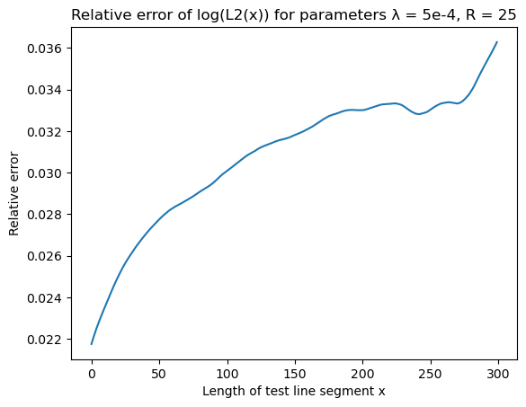
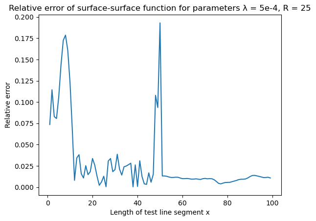
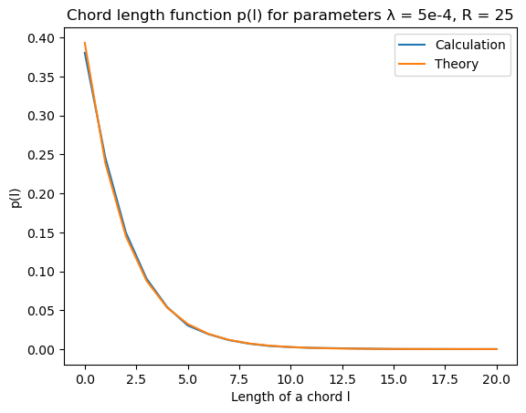
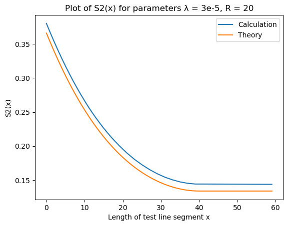
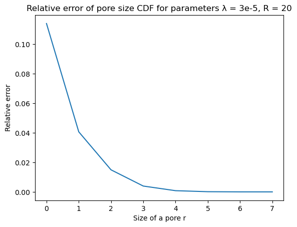

# Results

`CorrelationFunctions.jl` is tested on overlapping disks and balls of constant
radius $R$ with centers generated by Poisson process with parameter $\lambda$
(see section 5.1 of Random Heterogeneous Materials). An example of a
two-dimensional two-phase system generated in this way is on the picture ($R =
25$ and $\lambda = 5 \cdot 10^{-4}$):

Plots of all correlation functions calculated by `CorrelationFunctions.jl` for
overlapping disks along with their theoretical values are given below. There
are also plots of relative errors calculated as

$\text{err}(x) = \mid \frac{\text{calculation}(x) -
\text{theory}(x)}{\text{theory}(x)} \mid$

## Two-dimensional systems

### Methodology

All functions in this section with exception of pore size and chord length
functions are calculated on 15 random datasets generated with parameters $R =
25$ and $\lambda = 5 \cdot 10^{-4}$. Each dataset is an image with dimensions
`4000x4000` pixels. The final result is an average of results on those 15
datasets. When function fastly decreases to zero a plot of a natural logarithm
of that function is provided.

Pore size and chord length functions are calculated on one `4000x4000`
dataset with the same parameters as above. A theoretical value is computed by
averaging a theoretical function across each bin of a histogram returned by
`pore_size` or `chord_length` function. Because both pore size and cord length
functions decrease to zero with increase of their arguments, the relative errors
are calculated for the corresponding cummulative distribution functions.

### Two point $S_2(x)$ function

| S2  | Error |
|-----|-------|
|  |  |

### Lineal path $L_2(x)$ function

| L2  | Error |
|-----|-------|
|  |  |

### Surface-surface $F_{ss}(x)$ function

| Surface-surface   | Error |
|-------------------|-------|
|  |  |

### Surface-void $F_{sv}(x)$ function

| Surface-void     | Error |
|-------------------|-------|
|  |  |

### Pore size $P(x)$ function

| Pore size   | Error |
|-------------|-------|
|  |  |

### Chord length $p(x)$ function

| Chord length   | Error |
|----------------|-------|
|  |  |

## Three-dimensional systems

### Methodology

The idea is the same as in two-dimensional case, but chosen parameters are
slightly different. The functions are averaged over 5 `500x500x500` datasets
with ball radius $R = 20$ and Poisson process parameter $\lambda = 3 \cdot
10^{-5}$.

### Two point $S_2(x)$ function

| S2  | Error |
|-----|-------|
|  |  |

### Lineal path $L_2(x)$ function

| L2  | Error |
|-----|-------|
|  |  |

### Surface-surface $F_{ss}(x)$ function

| Surface-surface   | Error |
|-------------------|-------|
|  |  |

### Surface-void $F_{sv}(x)$ function

| Surface-void     | Error |
|-------------------|-------|
|  |  |

### Pore size $P(x)$ function

| Pore size   | Error |
|-------------|-------|
|  |  |

### Chord length $p(x)$ function

| Chord length   | Error |
|----------------|-------|
|  |  |
